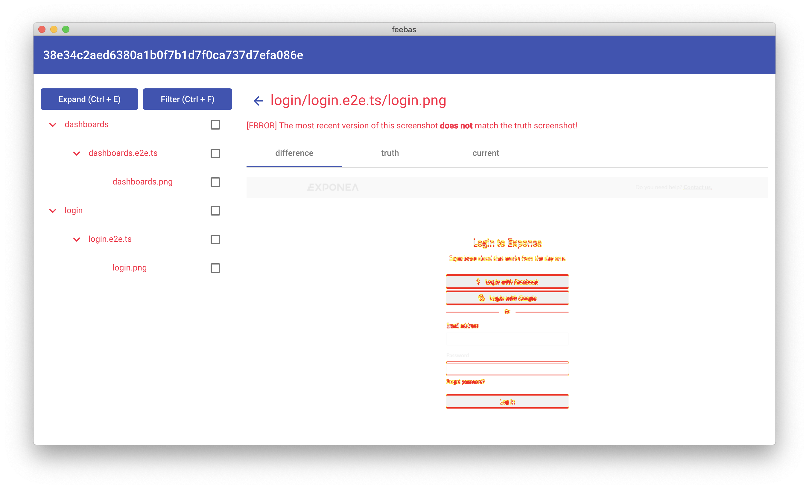

# feebas

<p align="center">
    
</p>

Feebas is screenshot comparison tool which is intended to be used as a part of catching the visual regressions in end to end tests.

```npm install --save-dev feebas```

# how it works?

The basic philosophy of feebas is to compare __current__ screenshots (e.g. screenshots taken during e2e tests in pipeline) with __truth__ screenshots which defines the desired appearance of the application. 
 
 
 
# recommended setup and workflow
 
1. Screenshot your application during e2e tests in pipeline (e.g. gitlab pipeline) and save the screenshots as job artifacts. If you are using [Cypress](https://github.com/cypress-io/cypress) you can use [screenshot](https://docs.cypress.io/api/commands/screenshot.html#Syntax) function to take screenshots.  
2. Define the truth screenshots (e.g. with first run of the pipeline) and save them into your repository. Setup [GIT LFS](https://git-lfs.github.com/) for your repository to handle the big files.
3. Setup feebas (proceed to section - [setup](#setup))

Now, when your pipeline fails because of visual regression. 

1. Checkout on the commit of that pipeline - run `git checkout <commit_id>`
2. Open feebas - `npx feebas`
3. Look for the differences in screenshots
 - if your visual changes __were intended__
   - Select screenshots you want to update
   - Click on the approve button in top right corner
   - It will overwrite screenshots in the repository, so you need to `git add .` them and then `git commit` them
 - if your visual changes __were not intended__
   - Fix the source of visual regression (bug)
   - Push the fix and proceed to the first step

## setup

1. Install feebas ```npm install --save-dev feebas``` (you probably want it as a dev dependency)
2. Create `feebas.config.json` in your project root, the file should look like this. Alternatively you can provide path to configuration file - `npx feebas --config ./example/path/to/feebas.config.json`. Example file with gitlab integration is available [here](./docs/Configuration.md).
    ```json
    {
        "projects": [
            {
                "name": "example",
                "screenshots": {
                    "current": {
                       ... // some integration (e.g. gitlab)
                    },
                    "truth": {
                       "type": "fs-local",
                       "path": "./example/path/to/truth_screenshots"
                   }
                }
            }
        ]
    }
    ``` 
   

### integrations

#### gitlab

- `url` - string - gitlab url
- `project_id` - number - id of the gitlab project - repository
- `authentication` - object
  - `type` - string - type of authentication into the gitlab, currently is available authentication only with _access token_. For authentication with `access_token` [get your gitlab access token](https://docs.gitlab.com/ee/user/profile/personal_access_tokens.html#creating-a-personal-access-token) and set it into the environment variable `FEEBAS_GITLAB_TOKEN`.
- `jobs` - array - array of jobs from which will be downloaded screenshots.
    - __job__
        - `name` - string - name of the job
        - `path` - string (optional) - path to the directory inside job artifacts (e.g. to the directory where are current screenshots stored)   
            ```json
                {
                  "name": "exmaple job name",
                  "path": "/example/path"
                }
            ```
- `strategy` - string - "merge" | "default" (optional) - when merge option is used all artifacts from the jobs will be merged, otherwise they will be stored in the directory with name of their job name
- `filter` - object - you can define files from artifacts which will be ignored
    - `rules` - array of strings
    - `strategy` - "blacklist" | "whitelist"
        ```json
            {
                  "rules": ["*(failed)*", "tmp_*"],
                  "strategy": "blacklist"
            }
         ```

### opening specific project and commit (experimental)

It is possible to open feebas from your browser. Just open URL in this format:
`feebas://projectId:commitId`. 

# Development

Development instructions are available [here](./docs/Development.md).